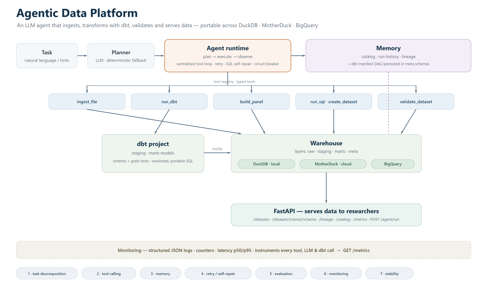
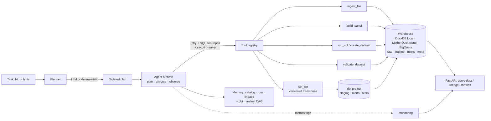

# Agentic Data Platform

An LLM **agent** that builds and serves a small **data platform**: it ingests
heterogeneous external sources, integrates them into clean keyed datasets,
validates them, tracks lineage, and serves them over an API — driven by a
plan → execute → observe loop with retry, self-correction, evaluation and
monitoring built in.

It is intentionally a *bridge* project: it exercises **data-platform
engineering** (ingest/transform/validate/serve, medallion layers, lineage,
DuckDB, an HTTP data API) **and** the **production-agent** concerns (task
decomposition, tool calling, memory, failure retry, eval, monitoring,
stability) in one dependency-light codebase you can read in an afternoon.

```
status: ✓ 15/15 unit tests   ✓ 3/3 eval tasks   ✓ 9/9 dbt models+tests
        ✓ runs fully offline (no API key required)   ✓ local DuckDB ↔ cloud MotherDuck ↔ BigQuery (dbt)
```



---

## Why this design

The platform treats the LLM as an **optional accelerator**, not a hard
dependency. With `ANTHROPIC_API_KEY` set, Claude does flexible planning and
repairs broken SQL between retries. Without a key, a **deterministic planner**
produces the same plans from structured hints — so CI, tests and the demo are
hermetic and reproducible. This "graceful degradation" is a deliberate
reliability choice, and it is the difference between a demo and a system.

## Architecture



Medallion layers in DuckDB: `raw` (verbatim ingest) → `staging`/`marts`
(transformed, served) → `meta` (the platform's own catalog, run history and
lineage — the agent's long-term memory is itself a governed dataset).

## The seven production concerns — and where each lives

| Concern | Where | What it does |
|---|---|---|
| **Task decomposition** | [`planner.py`](adp/planner.py) | LLM or deterministic planner turns a task into an ordered tool plan |
| **Tool calling** | [`agent.py`](adp/agent.py), [`tools.py`](adp/tools.py) | one centralized loop calls typed tools (ingest, **run_dbt**, panel, SQL, validate, profile) |
| **Orchestration / transforms** | [`dbt_runner.py`](adp/dbt_runner.py), [`transform/`](transform/) | agent orchestrates a versioned, tested **dbt** project; lineage recovered from dbt's manifest DAG |
| **Memory** | [`memory.py`](adp/memory.py) | persistent dataset catalog, run history and lineage in `meta.*` tables |
| **Failure retry / self-correction** | [`retry.py`](adp/retry.py), [`agent.py`](adp/agent.py) | exponential backoff; on retry the LLM repairs broken SQL (Reflexion-style) |
| **Evaluation** | [`eval_harness.py`](adp/eval_harness.py), [`eval/tasks.yaml`](eval/tasks.yaml) | config-driven, execution-based assertions; gates CI |
| **Monitoring** | [`monitoring.py`](adp/monitoring.py) | structured JSON logs + counters & latency percentiles via `GET /metrics` |
| **Stability** | `retry.py` (circuit breaker), `tools.py` (SELECT-only SQL, idempotent `CREATE OR REPLACE`, path checks) | treats the agent as untrusted; fails fast and stays up |

## Quickstart

```bash
uv venv --python 3.13
uv pip install -e ".[dev]"

uv run adp demo      # ingest 3 sources → build county-quarter panel → validate
uv run adp dbt       # ingest → orchestrate dbt build+test → manifest lineage
uv run pytest        # 15 tests
uv run adp eval      # evaluation suite (non-zero exit on failure)
uv run adp serve     # FastAPI on http://127.0.0.1:8000  (docs at /docs)
uv run adp ask "Ingest data/samples/*.csv and build a county-quarter panel"
```

Enable LLM planning/self-repair: `cp .env.example .env` and set `ANTHROPIC_API_KEY`.

## Transforms: dbt + portable warehouses

The transform layer is a real **dbt** project ([`transform/`](transform/)): three
staging models + a `county_quarter_panel` mart, with `not_null` and a
custom grain-uniqueness test. The agent runs it via the `run_dbt` tool
([`dbt_runner.py`](adp/dbt_runner.py)) using dbt's programmatic `dbtRunner`, then
recovers the model→source DAG from `target/manifest.json` as lineage.

Because the models are plain SQL with `ref()`/`source()`/`USING(...)`, they are
**warehouse-portable** — the same `dbt build` runs against:

| Target | Backend | How |
|---|---|---|
| `dev` | local **DuckDB** file | default; verified in CI |
| `cloud` | **MotherDuck** (serverless, DuckDB-compatible) | `ADP_WAREHOUSE_BACKEND=motherduck` + `MOTHERDUCK_TOKEN` |
| `gcp` | **Google BigQuery** | `pip install ".[gcp]"`, set GCP creds, `--target gcp` |

```bash
# run the whole platform on a cloud warehouse (free MotherDuck token):
export ADP_WAREHOUSE_BACKEND=motherduck MOTHERDUCK_TOKEN=...   # token from app.motherduck.com
uv run adp dbt        # ingest + dbt build now execute on MotherDuck, not a local file
```

## What the demo does

Generates three synthetic, deterministic sources keyed by `(county, quarter)` —
flood-insurance policies, property sales, mortgage records — then runs one agent
task that ingests all three, aggregates each source's numeric columns by the
shared keys, inner-joins them into a **200-row `county_quarter_panel`**
(10 counties × 20 quarters), and runs a data-quality gate (row count, unique
key, not-null). Catalog, lineage and metrics are persisted and served.

## API

| Method | Path | Purpose |
|---|---|---|
| GET | `/health` | liveness + capability summary |
| GET | `/metrics` | counters + latency percentiles |
| GET | `/catalog` | registered datasets |
| GET | `/datasets/{name}?limit=&offset=` | **serve dataset rows** |
| GET | `/datasets/{name}/schema` | column schema |
| GET | `/lineage/{name}` | upstream provenance edges |
| GET | `/runs`, `/runs/{id}` | agent run history |
| POST | `/agent/run` | run a task `{task, hints}` |

## Design decisions

- **Dependency-light on purpose.** The agent loop, retry, breaker, metrics and
  planner are ~600 lines of readable Python rather than a framework, so the
  engineering is legible. The patterns are borrowed from the references below.
- **Idempotent writes.** Every write tool uses `CREATE OR REPLACE`, so a retried
  step is safe — a precondition for safe retries.
- **Provenance by construction.** Catalog + lineage are written by the tools
  themselves, not bolted on, so every served dataset is traceable to its sources.
- **Validate-before-trust.** A dataset isn't "done" until its DQ gate passes; the
  eval harness consumes the same validation signal.
- **Portable transforms via dbt.** Business logic lives in versioned, tested dbt
  models — not in Python strings — so it runs unchanged on DuckDB, MotherDuck or
  BigQuery by switching a target. The warehouse is an implementation detail behind
  one `Warehouse` connection string.

## How this maps to the role (Anthropic — Research Engineer, Economic Research Data Platform)

- *"Build the data pipelines that turn raw … data into clean, reusable datasets"* → `ingest_file` + `build_panel` + medallion layers.
- *"Build self-serve workflows to ingest and integrate external data sources so they're interoperable"* → multi-source ingest + keyed panel integration.
- *"Develop the APIs, libraries, and interfaces that serve data to researchers"* → the FastAPI service.
- *"Ensure data reliability, integrity… across all… data infrastructure"* → validation gates, lineage, idempotency, monitoring.
- *Bonus: building systems on top of LLMs; data lineage/governance tooling; econometrics/quant-social-science framing.*

## Reference projects (researched, real)

- [motherduckdb/analytics-agent-duckdb-workshop](https://github.com/motherduckdb/analytics-agent-duckdb-workshop) — DuckDB text-to-SQL agent; closest stack match.
- [anthropics/claude-cookbooks](https://github.com/anthropics/claude-cookbooks) — canonical agent workflow patterns on a tiny LLM-call util.
- [microsoft/autogen](https://github.com/microsoft/autogen) (Magentic-One) — dual-ledger planning / progress reflection.
- [pydantic/pydantic-ai](https://github.com/pydantic/pydantic-ai) — "validation error = retry signal".
- [vanna-ai/vanna](https://github.com/vanna-ai/vanna) · [Canner/WrenAI](https://github.com/Canner/WrenAI) — text-to-SQL + governed semantic layer.
- [great-expectations](https://github.com/great-expectations/great_expectations) / [pandera](https://github.com/unionai-oss/pandera) — declarative validation as an objective eval signal.

## Limitations & roadmap (honest v1 scope)

This is a **batch** platform. Done and still to do:

- [x] **Versioned, tested transforms via dbt** (`transform/`), orchestrated by the agent.
- [x] **Cloud warehouse** behind one connection string — MotherDuck (serverless), with the dbt models portable to BigQuery (GCP).
- [x] **Lineage from dbt's manifest DAG**, merged with ingest lineage.
- [ ] Emit OpenTelemetry spans for distributed tracing (metrics exist; tracing next).
- [ ] Per-stage checkpointing for crash-resume on long ingests.
- [ ] Privacy-preserving aggregation (k-anonymity / differential privacy) on served datasets.
- [ ] Streaming / incremental dbt models for high-volume sources.

> Honest scope: the **cloud path is real and runnable** (DuckDB↔MotherDuck is the
> same connector; the dbt models run on BigQuery with a profile switch), but
> end-to-end at production scale, streaming, and raw-AWS/GCP infra are out of v1.

## License

MIT
